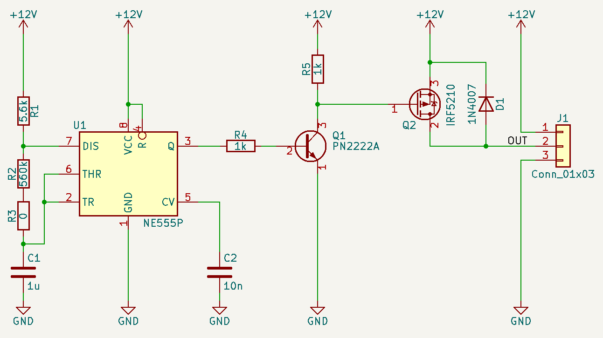
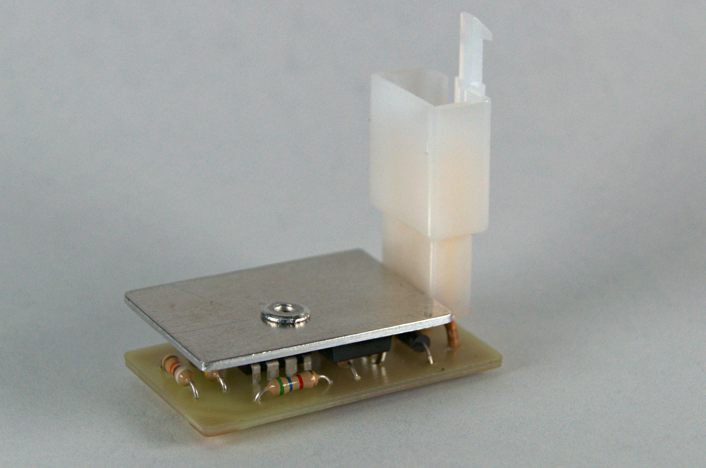
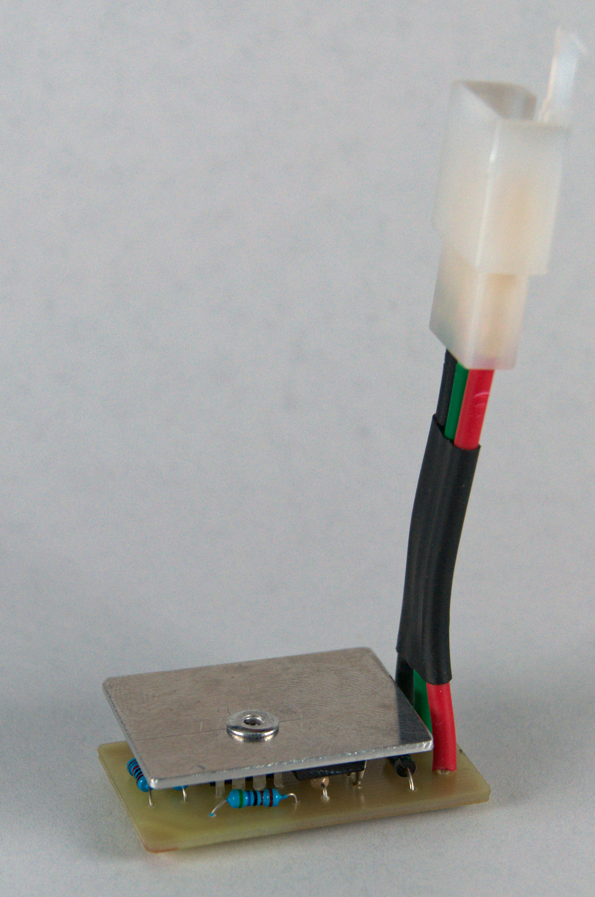
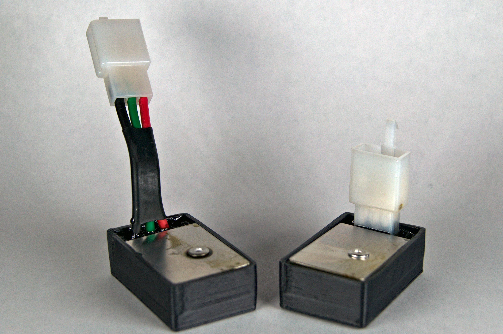

# Motorcycle Electronic Flasher Relay

*Copy from blog post: https://samueldperry.com/2022/08/13/motorcycle-electronic-flasher-relay/*

To install saddle bags on my 1988 Honda Shadow VT600 motorcycle I needed to relocate the rear indicator lights and since the original indicators were a little worse for wear looking I decided to upgrade to new indicator lights and housings. The motorcycle indicator market has gone mostly LED with almost no aftermarket options with traditional incandescent lights so I decided to upgrade the rear (and eventually the front) indicators to LED.

If you are not aware the stock indicators on my Honda Shadow are flashed using a flasher relay that does not play well with LED indicators. So to install LED indicators and not run into problems such as hyper flashing or the indicators not flashing at all I needed an electronic flasher relay that relies on circuitry and not electromechanics to blink the indicators.

I built the below electronic flasher relay that was heavily inspired by a circuit posted on Instructables, [LED Flasher by scd](https://www.instructables.com/LED-Flasher-automotive-or-motorcycle/). I built upon the design by replacing the BJT to control the lights with a power MOSFET and using a circuit board instead of free forming the circuit. I also used the same connector style and wiring as my original flasher relay so that the unit would be plug and play.

The circuit was assembled on a PCB that was milled using my [3018 Pro Router](https://samueldperry.com/cnc-3018-pro-router/). A section of 1/16″ aluminum was cut as a heatsink for the IRF5210 MOSFET and was pop riveted on with thermal paste between the interface. I made two versions, one with an integrated connector and one with a pigtail connector because I was unsure what would fit my motorcycle best. Then the circuit was placed in a 3D printed enclosure so that it could be potted to protect it from the weather and road grime.

The electronic flasher relay I built will work with both incandescent and LED indicators as well as a mix of the two. The IRF5210 MOSFET is capable of running a 40A load but should be derated to prevent overheating. While designing and building this unit I did find an already built electronic flasher relay for $20 that I ended up buying. It works just as well as the unit I built and also works with both incandescent and LED indicators. I am not sure what unit I will end up using permanently. I worry that the units I built are not fully protected for use in an automotive environment. I may have to put one of my units through some stress testing to see if I can trust it for the long term before installing it in the motorcycle.

For more motorcycle related projects check out my [blog](https://samueldperry.com/motorcycle/).

## Directory Outline
- [`~/pcb/`](pcb) is for KiCAD design files. The schematic, pcb layout, BOM, and GERBER files can be found here.
- [`~/enclosure/`](enclosure) is for mechanical CAD design files for the enclosure or box.
